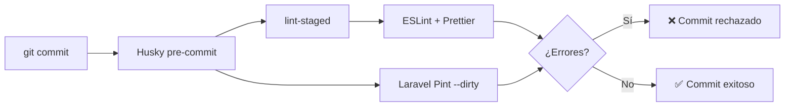
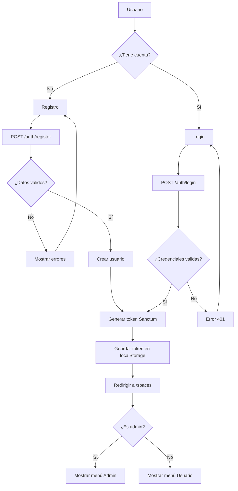
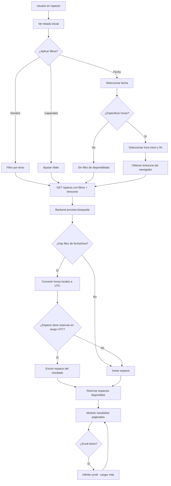
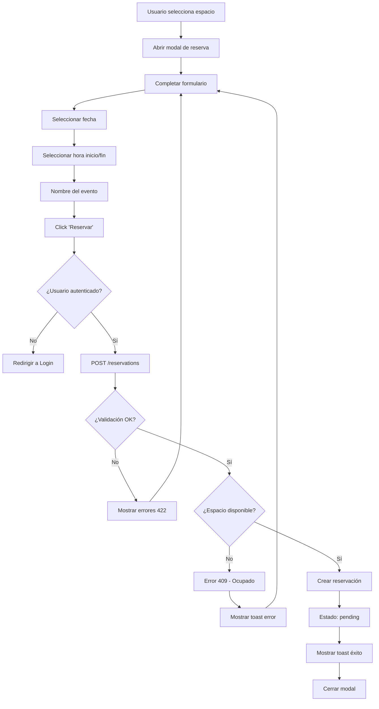
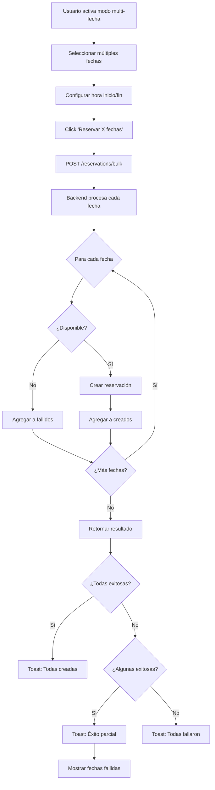
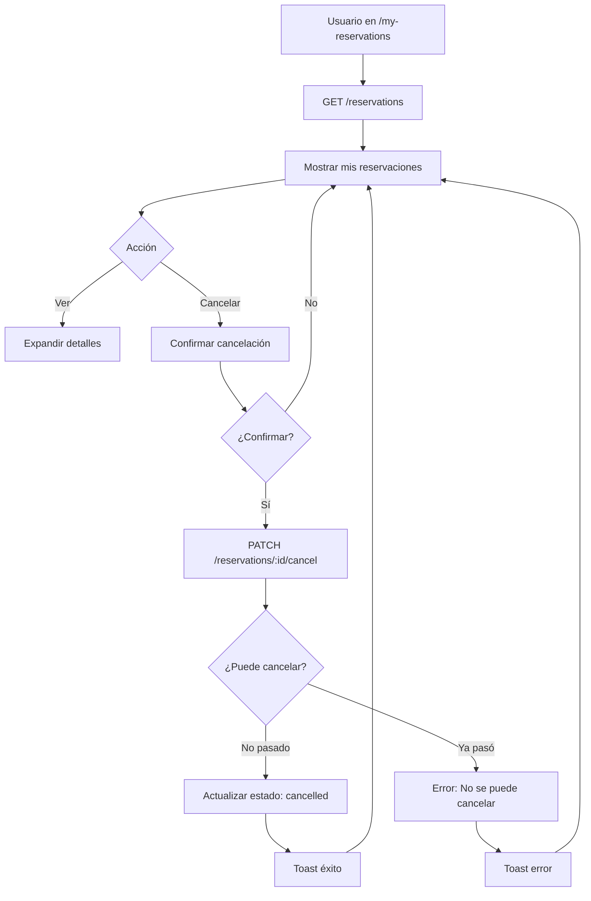
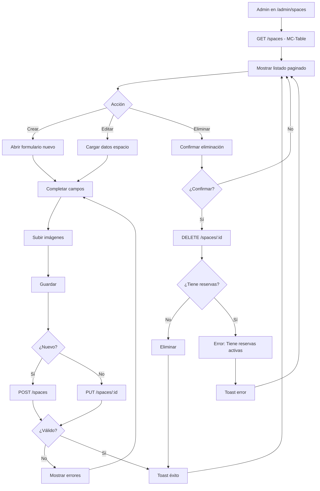
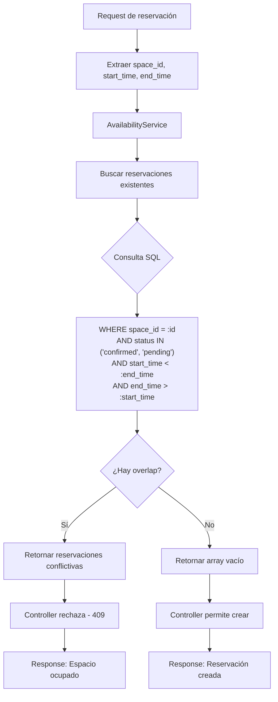

# SpaceBook - Sistema de Reserva de Espacios

> **Prueba Técnica Full Stack Developer** - TOTS TEST | Diciembre 2025

Sistema completo de reserva de espacios y salas con gestión administrativa, autenticación y reservaciones.

## 📋 Tabla de Contenidos

- [Requerimientos Técnicos](#-requerimientos-técnicos)
- [Criterios de Evaluación](#-criterios-de-evaluación)
- [Validación de Requerimientos](#-validación-de-requerimientos)
- [Tecnologías](#-tecnologías)
- [Instalación](#-instalación)
- [Credenciales](#-credenciales)
- [Características](#-características)
- [Estructura](#-estructura)
- [Tests](#-tests)
- [Code Quality](#-code-quality)

---

## 📝 Requerimientos Técnicos

### 1. Frontend (Angular)

| Requerimiento | Descripción |
|---------------|-------------|
| **Vista principal** | Página con listado de espacios disponibles, filtros por tipo, capacidad y disponibilidad por fechas. Al seleccionar un espacio, mostrar información detallada (nombre, descripción, capacidad, fotos, horarios disponibles, etc.) |
| **ABM de espacios** | Solo para usuarios administradores. Es obligatorio usar MC-Table (de MC Kit) en el listado |
| **Sistema de reservas** | Formulario para reservar indicando nombre del evento, fecha y hora de inicio/fin. Validación para evitar reservas en horarios ocupados |
| **Gestión de reservas** | Vista donde el usuario puede ver, modificar o cancelar sus reservas actuales |
| **Interfaz** | Usar Angular Material, PrimeNG o Tailwind (PrimeNG deseable). Implementar sistema de notificaciones (toasts) |
| **Extras opcionales** | Testing de componentes. Usar MC Kit |

### 2. Backend (Laravel)

| Requerimiento | Descripción |
|---------------|-------------|
| **API RESTful** | Autenticación con JWT (registro e inicio de sesión). CRUD para espacios y reservas. Validar superposición de horarios. Añadir funcionalidad extra documentada |
| **Protección de rutas** | Solo usuarios autenticados pueden gestionar sus reservas, sin acceso a las de otros |
| **Base de datos** | Migraciones y seeders para espacios y reservas. Relacionar usuarios con reservas |
| **Tests** | Suite de testing para validar funcionamiento de la API |

### 3. Requisitos Adicionales

| Requerimiento | Descripción |
|---------------|-------------|
| **Documentación API** | Documentación básica (Swagger) explicando endpoints y uso |
| **README.md** | Instrucciones de instalación, configuración y detalles relevantes |

### 4. Extras Opcionales

| Requerimiento | Descripción |
|---------------|-------------|
| **Calendario** | Implementar calendario que permita visualizar horarios reservados y libres en formato gráfico |

---

## 🎯 Criterios de Evaluación

| Criterio | Descripción |
|----------|-------------|
| **Código limpio** | Código organizado en frontend y backend |
| **Uso correcto de Angular y Laravel** | Aplicación adecuada de los frameworks |
| **Seguridad** | Autenticación y autorización correctas |
| **Validación** | Validación de formularios y manejo de errores |
| **Diseño e interfaz** | Creatividad y calidad del maquetado |
| **Documentación** | Calidad y claridad del README.md |

---

## ✅ Validación de Requerimientos

### Frontend (Angular)

| Requerimiento | Estado | Implementación |
|---------------|--------|----------------|
| Vista principal con listado de espacios | ✅ | `spaces-list.component.ts` con grid responsivo |
| Filtros por tipo, capacidad, disponibilidad | ✅ | `FilterSpacesPipe`, filtros `available_date`, `available_start_time`, `available_end_time` en API |
| Detalle de espacio (fotos, horarios, etc.) | ✅ | `space-detail.component.ts` |
| ABM de espacios (solo admin) | ✅ | `admin-spaces`, `space-form` con guards |
| **MC-Table en listado admin** | ✅ | `<mc-table>` en `admin-spaces.component.html` |
| Formulario de reservas (nombre evento, fecha) | ✅ | `reservation-form.component.ts` |
| **Reservas en múltiples fechas** | ✅ | Modo bulk en `reservation-form` |
| Validación horarios ocupados | ✅ | `AvailabilityService` + error 409 |
| Gestión de reservas (ver/modificar/cancelar) | ✅ | `my-reservations.component.ts` |
| PrimeNG | ✅ | Carousel, Dialog, DatePicker, Toast, Table |
| TailwindCSS | ✅ | Clases utilitarias en todos los componentes |
| Notificaciones Toast | ✅ | `p-toast` en componentes clave |
| Testing componentes | ✅ | 24 tests (auth.service, theme.service, app) |
| MC Kit | ✅ | `@mckit/table`, `@mckit/core` |

### Backend (Laravel)

| Requerimiento | Estado | Implementación |
|---------------|--------|----------------|
| API RESTful | ✅ | Controladores en `app/Http/Controllers/Api` |
| Autenticación JWT/Sanctum | ✅ | Laravel Sanctum (tokens API) |
| CRUD espacios | ✅ | `SpaceController` - create, show, update, destroy |
| CRUD reservas | ✅ | `ReservationController` - CRUD completo |
| **Reservas bulk** | ✅ | `POST /reservations/bulk` - múltiples fechas |
| Validación superposición horarios | ✅ | `AvailabilityService::getOverlappingReservations()` |
| **Filtro disponibilidad por hora** | ✅ | Params `available_start_time`, `available_end_time`, `timezone` |
| **Soporte multi-timezone** | ✅ | Conversión automática de hora local a UTC con Carbon |
| Funcionalidad extra documentada | ✅ | Dashboard estadísticas (`StatsController`) |
| Protección de rutas | ✅ | `auth:sanctum` + `role:admin` middleware |
| Solo acceso a reservas propias | ✅ | Validación en ReservationController |
| Migraciones | ✅ | `users`, `spaces`, `reservations` |
| Seeders | ✅ | 100 espacios, 2 usuarios, ~150 reservaciones |
| Tests API | ✅ | 71 tests (168 assertions) |

### Requisitos Adicionales

| Requerimiento | Estado | Implementación |
|---------------|--------|----------------|
| Documentación API (Swagger) | ✅ | `/api/documentation` |
| README.md con instrucciones | ✅ | Root + backend + frontend |

### Extras Opcionales

| Requerimiento | Estado | Implementación |
|---------------|--------|----------------|
| Calendario gráfico horarios | ✅ | FullCalendar en `space-detail` y `/calendar` |
| Testing frontend | ✅ | 24 tests con Vitest |
| MC Kit completo | ✅ | MC-Table + MCListResponse |
| SOLID Principles | ✅ | Interfaces (ISP), Inyección de Dependencias (DIP) |
| **Reservas múltiples fechas** | ✅ | Endpoint bulk + UI multi-fecha |
| **Filtro por rango horario** | ✅ | Buscar espacios libres en hora específica |

---

## 🛠️ Tecnologías

### Backend
| Tecnología | Versión |
|------------|---------|
| Laravel | 12.44.0 |
| PHP | 8.2+ |
| SQLite | 3.x |
| Sanctum | 4.x |
| Swagger/OpenAPI | 4.x |

### Frontend
| Tecnología | Versión |
|------------|---------|
| Angular | 21.0.6 |
| PrimeNG | 21.0.2 |
| TailwindCSS | 3.4.19 |
| FullCalendar | 6.1.20 |
| @mckit/table | 19.0.14 |

---

## 🚀 Instalación

### 1. Clonar Repositorio

```bash
git clone <repo-url> tots_test
cd tots_test
```

### 2. Backend

```bash
cd backend
composer install
cp .env.example .env
php artisan key:generate
php artisan migrate:fresh --seed
php artisan serve
```

API disponible en: `http://localhost:8000/api`

### 3. Frontend

```bash
cd frontend
pnpm install
pnpm start
```

Aplicación disponible en: `http://localhost:4200`

### 4. Verificar

```bash
# Terminal 1: Backend
cd backend && php artisan serve

# Terminal 2: Frontend
cd frontend && pnpm start
```

---

## 🔐 Credenciales

| Rol | Email | Contraseña |
|-----|-------|-----------|
| Admin | admin@espacios.com | password123 |
| Usuario | juan@ejemplo.com | password123 |

---

## ✨ Características

### Backend
- Autenticación con Laravel Sanctum
- CRUD de espacios con filtros y paginación
- Sistema de reservaciones con validación de disponibilidad
- Dashboard de estadísticas (admin)
- 100 espacios con datos aleatorios (seeder)
- Documentación OpenAPI/Swagger

### Frontend
- Interfaz responsiva (3/2/1 columnas)
- Dark mode completo (Light/Dark/System)
- Infinite scroll en listado de espacios
- Calendario interactivo (FullCalendar)
- Carousel de múltiples imágenes
- Panel admin con MC-Table
- CRUD completo de reservaciones
- **Filtro por fecha de disponibilidad** en buscador de espacios
- **Cancelación de reservaciones** desde "Mis Reservaciones"

### Adicionales
- Múltiples imágenes por espacio
- Calendario público de disponibilidad
- Estadísticas en tiempo real
- Validación frontend y backend
- Menú admin con dropdown

---

## 📐 Estructura

```
tots_test/
├── backend/                 # API REST Laravel
│   ├── app/
│   │   ├── Http/Controllers/Api/
│   │   ├── Models/
│   │   └── Services/
│   ├── database/
│   │   ├── migrations/
│   │   └── seeders/
│   └── routes/api.php
│
├── frontend/                # Angular App
│   └── src/app/
│       ├── core/            # Servicios, guards
│       ├── shared/          # Interfaces, pipes
│       └── features/
│           ├── auth/
│           ├── spaces/
│           ├── reservations/
│           ├── calendar/
│           └── admin/
```

---

## 🧪 Tests

### Backend (71 tests, 168 assertions)
```bash
cd backend
php artisan test
```

### Frontend (24 tests)
```bash
cd frontend
pnpm test
```

---

## 🧹 Code Quality

El proyecto implementa herramientas de linting y formateo automático para mantener un código limpio y consistente.

### Herramientas Configuradas

| Proyecto | Herramienta | Propósito |
|----------|-------------|----------|
| Frontend | **ESLint** | Análisis estático de TypeScript/Angular |
| Frontend | **Prettier** | Formateo automático de código |
| Frontend | **lint-staged** | Ejecuta linters solo en archivos staged |
| Backend | **Laravel Pint** | Formateo PHP (PSR-12 + Laravel) |
| Monorepo | **Husky** | Git hooks para pre-commit |

### Flujo Pre-commit



### Comandos Disponibles

**Frontend:**
```bash
cd frontend
pnpm lint          # Lint y fix automático
pnpm lint:check    # Solo verificar (sin cambios)
pnpm format        # Formatear con Prettier
pnpm format:check  # Verificar formato
```

**Backend:**
```bash
cd backend
composer lint       # Formatear con Pint
composer lint:check # Verificar sin cambiar
```

**Monorepo (raíz):**
```bash
pnpm lint           # Lint frontend + backend
pnpm format         # Formatear frontend
```

### Archivos de Configuración

| Archivo | Ubicación | Descripción |
|---------|-----------|-------------|
| `eslint.config.mjs` | `/frontend/` | Reglas ESLint para Angular |
| `.prettierrc` | `/frontend/` | Configuración Prettier |
| `pint.json` | `/backend/` | Reglas Laravel Pint |
| `pre-commit` | `/.husky/` | Hook de pre-commit |

### Beneficios

- ✅ **Consistencia**: Todo el equipo usa las mismas reglas
- ✅ **Automatización**: Formateo automático en cada commit
- ✅ **Prevención**: Errores detectados antes de llegar al repo
- ✅ **Code Reviews**: Enfocados en lógica, no en formato

---

## 🔄 Diagramas de Flujo

### Flujo de Autenticación



### Flujo de Búsqueda de Espacios



> **Nota sobre Timezones**: El frontend envía el timezone del navegador (ej: `America/Caracas`) junto con las horas de búsqueda. El backend convierte estas horas locales a UTC usando Carbon antes de comparar con las reservaciones almacenadas, garantizando resultados correctos independientemente de la zona horaria del usuario.

### Flujo de Reservación Simple



### Flujo de Reservación Múltiples Fechas (Bulk)



### Flujo de Gestión de Reservaciones (Usuario)



### Flujo Admin - CRUD Espacios



### Flujo de Validación de Disponibilidad



---

## 📖 Documentación

- **Swagger API**: /api/documentation
- **Backend README**: [backend/README.md](backend/README.md)
- **Frontend README**: [frontend/README.md](frontend/README.md)

---

## 👨‍💻 Autor

**Fernando Aponte**
- GitHub: [@fjah90](https://github.com/fjah90)
- LinkedIn: [Fernando Aponte](https://linkedin.com)
